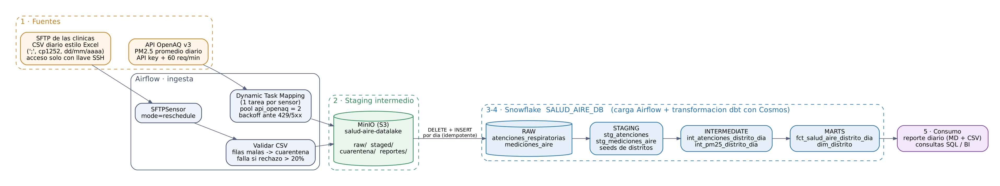

# Salud-Aire Lima — pipeline de datos con Apache Airflow

Pipeline de datos de punta a punta que cruza **la calidad del aire (PM2.5)** con las
**atenciones por enfermedades respiratorias** en los distritos de Lima Metropolitana, para
que un área de salud pública sepa **cada mañana en qué distritos el aire contaminado coincide
con un alza de atenciones** y pueda reforzar personal o lanzar campañas preventivas.

> **En 2 minutos:** cada día a las 06:00 Airflow espera el CSV de atenciones que la red de
> clínicas deja en un **SFTP** y consulta la **API pública OpenAQ** (PM2.5 por estación).
> Todo pasa primero por un data lake **MinIO (S3)**, se carga a **Snowflake** y **dbt**
> (orquestado con **Cosmos**) construye una tabla por distrito y día con atenciones, PM2.5,
> categoría según la guía OMS y el ECA Perú, y una **bandera de alerta**. El pipeline termina
> publicando un reporte diario.

Proyecto Final Integrador — PEDE/9 Apache Airflow.

---

## Contenido

1. [Arquitectura](#1-arquitectura)
2. [Fuentes de datos](#2-fuentes-de-datos)
3. [Cómo levantar el proyecto (Docker)](#3-cómo-levantar-el-proyecto-docker)
4. [Cómo correr el pipeline](#4-cómo-correr-el-pipeline)
5. [Qué hace cada DAG](#5-qué-hace-cada-dag)
6. [Modelo de datos (dbt)](#6-modelo-de-datos-dbt)
7. [Testing y CI/CD](#7-testing-y-cicd)
8. [Seguridad](#8-seguridad)
9. [Decisiones de diseño](#9-decisiones-de-diseño)
10. [Glosario de negocio](#10-glosario-de-negocio)
11. [Estructura del repositorio](#11-estructura-del-repositorio)
12. [Problemas comunes](#12-problemas-comunes)

---

## 1. Arquitectura



| Etapa | Qué pasa | Tecnología |
|---|---|---|
| 1. Ingesta | Sensor espera el CSV en el SFTP; extracción de la API con un *mapped task* por sensor | Airflow (`SFTPSensor`, `SFTPHook`, Dynamic Task Mapping, pool) |
| 2. Staging intermedio | Copia fiel del original (`raw/`), versión validada (`staged/`) y filas rechazadas (`cuarentena/`) | MinIO (fork `pgsty/minio`, API S3, `S3Hook`) |
| 3. Carga al warehouse | `DELETE + INSERT` del día en una transacción (idempotente) | Snowflake (`SnowflakeHook`) |
| 4. Transformación | `staging → intermediate → marts`, con tests después de cada modelo | dbt + Astronomer Cosmos (`DbtTaskGroup`) |
| 5. Consumo | Reporte diario Markdown + CSV en `reportes/` y consultas SQL de ejemplo | Snowflake / MinIO |

## 2. Fuentes de datos

| Fuente | Tipo | Por qué es "imperfecta" | Cómo se maneja |
|---|---|---|---|
| **Atenciones respiratorias** de la red de clínicas | Archivo CSV por **SFTP** | Exportado de Excel: separador `;`, codificación Windows-1252, encabezados con tildes y `N°`, fechas `dd/mm/aaaa`, celdas `N/D`, negativos, reenvíos duplicados, distritos escritos de muchas formas (`S.J.L.`, `SJL`, `San Juan de Lurigancho`). Puede llegar tarde. | Sensor en `reschedule` con timeout de 3 h; validación estructural en Python (cuarentena con motivo, falla explícita si se rechaza > 20 %); normalización y deduplicación en dbt. |
| **Calidad del aire** — [API OpenAQ v3](https://docs.openaq.org) | API REST pública | Exige API key, tiene límite de uso (plan gratuito: 60 req/min y 2 000 req/h) y responde `429`; algunas estaciones se apagan. | API key en una Connection; pool de 2 slots; reintentos con backoff que respetan `Retry-After`; sin reintento ante `401/403`; descarte de estaciones sin datos recientes. |

**Sobre los datos simulados (sección 12 del enunciado):** no tenemos acceso al SFTP real de
una red de clínicas, así que el DAG `simulador_envio_clinicas` hace el papel del proveedor y
sube un CSV realista (con todos los defectos de arriba) al SFTP. El pipeline lo procesa con el
mismo código que usaría contra el servidor real. Para la API, el pipeline consulta **OpenAQ de
verdad**; solo si la API no estuviera disponible el día de la demo se puede poner
`FUENTE_CALIDAD_AIRE=simulada` en `.env` (los registros quedan marcados con
`fuente = 'simulada'` y estaciones `SIM-*`, nunca se mezclan en silencio).

## 3. Cómo levantar el proyecto (Docker)

### Requisitos

- Docker Desktop con **al menos 6 GB de RAM** asignados (*Settings → Resources*).
- Git.
- Cuenta de **Snowflake** (sirve la trial).
- **API key de OpenAQ** (gratis en <https://explore.openaq.org/register>).
- Python 3.12 *solo* si quieres correr los tests fuera de Docker.

### Paso 1 — Clonar y crear el `.env`

```powershell
git clone https://github.com/<usuario>/salud-aire-lima-pipeline.git
cd salud-aire-lima-pipeline

# Windows
powershell -ExecutionPolicy Bypass -File .\scripts\preparar_env.ps1
# Linux / Mac
./scripts/preparar_env.sh
```

El script crea `.env` (que **no** se sube a Git) y genera contraseñas aleatorias para todos
los servicios internos. Al final muestra la contraseña del usuario `admin` de Airflow.
Abre `.env` y completa **solo** estas cuatro líneas:

```dotenv
SNOWFLAKE_ACCOUNT=ab12345.us-east-1   # Snowsight -> tu usuario -> Account -> View account details
SNOWFLAKE_USER=tu_usuario
SNOWFLAKE_PASSWORD=tu_password        # sin comillas dobles, sin $ ni \
OPENAQ_API_KEY=tu_api_key
```

### Paso 2 — Preparar Snowflake (una sola vez)

En Snowsight abre un worksheet, pega [`infra/snowflake/01_setup_snowflake.sql`](infra/snowflake/01_setup_snowflake.sql),
reemplaza `TU_USUARIO_SNOWFLAKE` (3 líneas al final) y ejecútalo completo (*Run All*).
Crea el warehouse `WH_SALUD_AIRE` (XSMALL, `AUTO_SUSPEND = 60`), la base `SALUD_AIRE_DB`
con sus esquemas, las tablas `RAW` y tres roles de mínimo privilegio.

### Paso 3 — Construir y levantar

```powershell
docker compose build            # primera vez: 5-10 min (instala Cosmos y dbt)
docker compose up airflow-init  # migra la BD, crea el admin y el pool; debe terminar con "exited with code 0"
docker compose up -d
docker compose ps               # esperar a que todo diga "healthy" (1-2 min)
```

| Servicio | URL | Usuario |
|---|---|---|
| Airflow | <http://localhost:8080> | `admin` / la contraseña que mostró el script (`AIRFLOW_ADMIN_PASSWORD` en `.env`) |
| Consola MinIO | <http://localhost:9001> | `MINIO_ROOT_USER` / `MINIO_ROOT_PASSWORD` de `.env` |
| SFTP (opcional, p. ej. WinSCP) | `localhost:2222` | `clinicas`, solo con llave (ver sección 8) |

`docker compose up` también levanta y configura solo:

- **sftp-keygen**: genera la llave SSH ed25519 con la que Airflow entra al SFTP.
- **minio-init**: crea el bucket, un usuario de servicio con permisos mínimos y las reglas de ciclo de vida.
- **airflow-init**: crea el pool `api_openaq` (2 slots).

Las Connections y Variables de Airflow se inyectan desde `.env`; no hay que crear nada a mano en la UI.

### Paso 4 — Verificar

```powershell
docker compose exec airflow-scheduler airflow connections get snowflake_salud_aire -o json
docker compose exec airflow-scheduler bash -c "cd /opt/airflow/dags/dbt/salud_aire && /opt/airflow/dbt_venv/bin/dbt debug --profiles-dir ."
docker compose exec airflow-scheduler pytest /opt/airflow/tests -q
```

`dbt debug` debe terminar con **All checks passed!**

### Apagar

```powershell
docker compose down      # conserva historial, data lake y llaves
docker compose down -v   # borra TODO (volúmenes incluidos) para empezar de cero
```

## 4. Cómo correr el pipeline

1. En la UI de Airflow, activa (*unpause*) `simulador_envio_clinicas` y `pipeline_salud_aire`.
2. Dispara **`simulador_envio_clinicas`** con *Trigger DAG w/ config* →
   `{"fecha_proceso": "2026-10-07"}` (o déjalo vacío para "ayer"). Sube el CSV al SFTP.
3. Dispara **`pipeline_salud_aire`** con la **misma** `fecha_proceso`. El sensor encuentra
   el archivo y el pipeline corre de punta a punta (~5-10 min).
4. Revisa los resultados:
   - **MinIO** (<http://localhost:9001>) → bucket `salud-aire-datalake` → `reportes/salud_aire/fecha=.../reporte.md`.
   - **Snowflake**: `SELECT * FROM SALUD_AIRE_DB.MARTS.FCT_SALUD_AIRE_DISTRITO_DIA ORDER BY fecha DESC, alerta_salud_publica DESC;`
   - Más consultas en [`dags/dbt/salud_aire/analyses/consultas_consumo.sql`](dags/dbt/salud_aire/analyses/consultas_consumo.sql).

> El promedio de 7 días y la alerta necesitan historia. Para la demo, corre ambos DAGs para
> 8 días seguidos (por ejemplo, del `2026-09-30` al `2026-10-07`); el mart se reconstruye completo en cada corrida.

En operación normal no hay que hacer nada: el simulador corre a las 05:30 y el pipeline a las 06:00 (hora de Lima).

## 5. Qué hace cada DAG

### `pipeline_salud_aire` (productivo) — `0 6 * * *`, `catchup=False`

```
resolver_fecha
├── ingesta_atenciones_sftp   [TaskGroup]
│     esperar_archivo_atenciones (SFTPSensor, reschedule, timeout 3 h)
│     → transferir_atenciones_a_minio (validación + raw/staged/cuarentena)
├── ingesta_calidad_aire_api  [TaskGroup]
│     listar_sensores_pm25 → extraer_promedio_diario.expand(sensor=...) [pool api_openaq]
│     → consolidar_mediciones
├── carga_snowflake_raw       [TaskGroup]  cargar_atenciones · cargar_mediciones
├── transformacion_dbt        [DbtTaskGroup de Cosmos: una tarea por seed/modelo/test]
└── publicar_reporte
```

| Tarea / grupo | `retries` | Por qué |
|---|---|---|
| Por defecto | 2, backoff exponencial desde 2 min (tope 20 min) | Fallas transitorias de red/SFTP se arreglan solas en minutos. |
| `esperar_archivo_atenciones` | 1; `timeout` 3 h | El proveedor tiene hasta las 09:00; luego debe fallar y alertar, no esperar indefinidamente. |
| `extraer_promedio_diario` | 4, backoff desde 1 min, pool de 2 | La API limita el uso; además el cliente ya reintenta 429/5xx dentro de la tarea. |
| `cargar_*` | 3 cada 1 min | El warehouse puede estar reanudándose (`AUTO_RESUME`). La carga es idempotente, así que reintentar es seguro. |
| Tareas dbt | 1 | Un fallo de dbt casi siempre es de datos o de SQL: reintentar varias veces no lo arregla. |
| `transferir_atenciones_a_minio` | 2, pero el **umbral de rechazo** lanza un error claro | Un archivo malo no se arregla reintentando: se avisa a la clínica. |

Además: `on_failure_callback` con un mensaje de alerta estructurado, `execution_timeout` de 30 min
por tarea, `dagrun_timeout` de 5 h y `max_active_runs=1`. Airflow 3 eliminó los SLA clásicos, así
que se usan estos timeouts en su lugar.

**Reprocesar un día:** *Trigger DAG w/ config* con `{"fecha_proceso": "AAAA-MM-DD"}`. Como la carga
borra e inserta el día completo, reprocesar no duplica datos.

### `simulador_envio_clinicas` — `30 5 * * *`

Simula al proveedor externo (ver sección 2). En producción se elimina.

## 6. Modelo de datos (dbt)

```
seeds: distritos_lima, alias_distritos
source raw.atenciones_respiratorias ─► stg_atenciones ──────► int_atenciones_distrito_dia ─┐
source raw.mediciones_aire ─────────► stg_mediciones_aire ─► int_pm25_distrito_dia ────────┼─► fct_salud_aire_distrito_dia
seed distritos_lima ──────────────────────────────────────► dim_distrito ─────────────────┘
```

| Modelo | Capa | Lógica de negocio |
|---|---|---|
| `stg_atenciones` | staging (vista) | Normaliza el texto del distrito (macro `normalizar_texto`); deduplica reenvíos (gana la última fila del archivo). |
| `stg_mediciones_aire` | staging (vista) | Una medición PM2.5 por estación y día (promedia sensores repetidos). |
| `int_atenciones_distrito_dia` | intermediate (vista) | Traduce el distrito escrito por la clínica a su **ubigeo** con el diccionario `alias_distritos`; agrega por grupos vulnerables (< 5 años, 60+), asma y neumonía. |
| `int_pm25_distrito_dia` | intermediate (vista) | Asigna a cada distrito la **estación más cercana** (`HAVERSINE`) con cobertura ≥ 50 % y a ≤ 10 km. |
| `fct_salud_aire_distrito_dia` | marts (tabla) | Rejilla completa distrito × día; categoría de aire (OMS / ECA); variación frente al promedio de los 7 días previos; **alerta**. |
| `dim_distrito` | marts (tabla) | Dimensión de distritos y zonas. |

Los parámetros de negocio (umbrales OMS/ECA, radio, cobertura, % de alza) viven en `vars` de
[`dbt_project.yml`](dags/dbt/salud_aire/dbt_project.yml): cambiar un umbral es un cambio versionado y revisado por PR.

**Tests de dbt (41)** — los prioritarios:

| Test | Severidad | Qué protege |
|---|---|---|
| `combinacion_unica` (test genérico propio) en cada modelo | error | Que ningún join duplique filas (clave natural). |
| `assert_conciliacion_atenciones` (singular) | error | Que la suma de atenciones del mart sea **exactamente** la de staging: nada se pierde ni se duplica. |
| `relationships` `stg_atenciones.distrito_reportado → alias_distritos` | **warn** + `store_failures` | Una forma nueva de escribir un distrito no detiene el pipeline, pero queda en `AUDITORIA.DISTRITOS_SIN_MAPEAR` para agregarla al seed. |
| `no_negativo`, `valor_en_rango` (genéricos propios) | error | Conteos ≥ 0; PM2.5 entre 0 y 1000 µg/m³; distancia ≤ radio. |
| `accepted_values`, `not_null`, `unique`, `relationships` | error | Dominios válidos (grupos de edad, categorías, zonas) e integridad referencial. |

## 7. Testing y CI/CD

**Tests de Python (pytest, 58 tests)** — la lógica de negocio vive en `dags/salud_aire/`, sin
imports de Airflow, y se prueba en milisegundos:

| Archivo | Qué prueba |
|---|---|
| `test_atenciones.py` | CSV de Excel (`;`, cp1252), encabezados con tildes, cada motivo de cuarentena, archivo sin columnas, umbral de rechazo. |
| `test_calidad_aire.py` | Cliente OpenAQ con la API mockeada: reintento ante 429 respetando `Retry-After`, errores de red, **no** reintentar 401, fallo explícito al agotar intentos, parseo de respuestas. |
| `test_carga_y_reporte.py` | Carga idempotente (BEGIN/DELETE/INSERT/COMMIT, ROLLBACK si falla, no mezclar días, rechazo de inyección SQL), fecha de negocio en hora de Lima, reporte. |
| `test_simulacion.py` | El archivo simulado es determinístico y el pipeline real lo procesa. |
| `test_dags.py` | DagBag sin errores, `schedule` real + `catchup=False`, `owner` y `retries` en todas las tareas, sensor en `reschedule`, pool de la API, una tarea de Cosmos por modelo, orden carga → dbt → reporte, **ningún secreto en el código**, `profiles.yml` con `env_var()`. |

```powershell
# Local (fuera de Docker), opcional:
python -m venv .venv; .\.venv\Scripts\Activate.ps1
pip install "apache-airflow==3.0.6" -r requirements.txt --constraint https://raw.githubusercontent.com/apache/airflow/constraints-3.0.6/constraints-3.12.txt
pip install -r requirements-dev.txt
ruff check dags tests
pytest -m "not dagbag"   # solo la lógica de negocio (no necesita dbt)
```

**GitHub Actions**

| Workflow | Cuándo | Qué hace |
|---|---|---|
| [`ci.yml`](.github/workflows/ci.yml) → job **`lint-and-test`** | Cada Pull Request a `main` | Verifica que no se versionen secretos → instala Airflow con constraints oficiales y dbt en venv aparte → `ruff` → `dbt parse` → `pytest`. Credenciales de Snowflake **ficticias** (dbt no se conecta). |
| [`cd.yml`](.github/workflows/cd.yml) | Merge a `main` | Vuelve a correr el CI y, solo si pasa, construye y publica la imagen de Airflow en GitHub Container Registry (`ghcr.io/<usuario>/salud-aire-airflow:<sha>`). Usa el `GITHUB_TOKEN` automático: no hay secretos propios. |

**Branch Protection en `main`:** requiere Pull Request y que el check `lint-and-test` esté en verde
antes de mergear (configuración paso a paso en [`docs/GUIA_ENTREGA.md`](docs/GUIA_ENTREGA.md)).

## 8. Seguridad

- **Cero credenciales en el código o en Git.** Todo secreto vive en `.env` (en `.gitignore`).
  `docker-compose.yaml` lo inyecta como Connections (`AIRFLOW_CONN_*`) y Variables
  (`AIRFLOW_VAR_*`) de Airflow, y `profiles.yml` lo lee con `env_var()`. Un test y un paso del CI
  fallan si aparece un secreto o un `.env` versionado. Verificación: `git log --all -- .env` no devuelve nada.
- **Connections fuera de la base de metadatos.** Al venir de variables de entorno, las
  contraseñas no se guardan en Postgres. La Fernet key se genera por máquina igualmente.
- **SFTP solo con llave SSH.** `sftp-keygen` genera un par ed25519 por instalación; la privada
  solo la montan los contenedores de Airflow (solo lectura) y el servidor solo ve la pública. El
  usuario `clinicas` no tiene contraseña. En desarrollo se usa `no_host_key_check` porque el
  servidor se recrea; en producción se fija el *host key* del proveedor.
- **Mínimo privilegio en MinIO.** Airflow no usa el usuario root: usa `airflow-datalake`, con
  una política que solo permite listar, leer y escribir en **un** bucket, sin borrar
  ([`infra/minio/politica_airflow.json`](infra/minio/politica_airflow.json)).
- **Mínimo privilegio en Snowflake** (tres roles):
  `ROLE_SALUD_AIRE_INGESTA` (Airflow: `INSERT/DELETE` solo en las 2 tablas RAW + lectura de MARTS),
  `ROLE_SALUD_AIRE_TRANSFORMACION` (dbt: lee RAW, crea solo en sus esquemas),
  `ROLE_SALUD_AIRE_LECTOR` (consumo: solo MARTS). Ninguno puede modificar el warehouse.
- **Inyección SQL:** valores siempre parametrizados; los nombres de tabla/columna se validan con una expresión regular.
- **La API key de OpenAQ** viaja en la cabecera `X-API-Key` (nunca en la URL ni en los logs).

## 9. Decisiones de diseño

| # | Decisión | Alternativa descartada y por qué |
|---|---|---|
| D1 | Validación **estructural** en Python antes de cargar; reglas de **negocio** en dbt | Todo en dbt: un archivo con columnas faltantes rompería la carga sin un mensaje útil. Todo en Python: la normalización de distritos no quedaría versionada y testeada como SQL. |
| D2 | **Cuarentena + umbral** (20 %) en vez de rechazar el archivo por una fila mala | Rechazar todo frenaría el reporte por un `N/D`; aceptar todo escondería un archivo corrupto. |
| D3 | **Carga idempotente** `DELETE + INSERT` por día en una transacción | `COPY INTO` con stage externo: Snowflake no alcanza un MinIO local. `INSERT` sin borrar: los reintentos duplicarían datos. |
| D4 | **LocalExecutor** | Celery: Redis + worker cuestan ~1 GB de RAM para ~40 tareas diarias. Para escalar se cambia una línea y se agregan workers. |
| D5 | **dbt en un venv separado** + Cosmos en modo `subprocess` | Mismo entorno que Airflow: es la causa más común de conflictos de dependencias (recomendación de Cosmos). |
| D6 | **Tests genéricos propios** en vez de `dbt_utils` | Evita `dbt deps` (red) en cada corrida y demuestra tests personalizados. |
| D7 | Estación **más cercana** (`HAVERSINE`) con radio y cobertura mínimos | Promedio de toda Lima: borra justo la diferencia entre distritos que se quiere ver. |
| D8 | Mart como tabla reconstruida completa | Incremental: el volumen es pequeño (12 distritos × días) y la ventana de 7 días complica el `merge`. Se migraría al crecer. |
| D9 | Connections por variables de entorno | Crear en la UI: no reproducible en otra máquina y guarda secretos en la BD de metadatos. |

## 10. Glosario de negocio

| Término | Definición |
|---|---|
| **Atención respiratoria** | Consulta registrada con un diagnóstico del capítulo J de la CIE-10 (enfermedades del sistema respiratorio). Se cuenta por distrito de **residencia** del paciente, no por ubicación de la clínica. |
| **PM2.5** | Material particulado de diámetro ≤ 2,5 µm. Penetra hasta los alvéolos; se mide en µg/m³. Se usa el **promedio de 24 h**. |
| **Guía OMS (15 µg/m³)** | Valor guía de la OMS (2021) para PM2.5 en 24 h. Por encima: `SOBRE_GUIA_OMS`. |
| **ECA Perú (50 µg/m³)** | Estándar de Calidad Ambiental para aire del Perú (D.S. 003-2017-MINAM), PM2.5 24 h. Por encima: `SOBRE_ECA_PERU`. |
| **Estación de referencia** | Estación de monitoreo más cercana al centroide del distrito, a ≤ 10 km y con ≥ 50 % de horas medidas ese día. Si no hay: `SIN_COBERTURA`. |
| **Ubigeo** | Código oficial del INEI que identifica a cada distrito (Ate = 150103). Es la clave que une las dos fuentes. |
| **Grupos vulnerables** | Menores de 5 años y adultos de 60 años a más: los más sensibles a la contaminación. |
| **Alerta de salud pública** | Distrito-día con aire sobre la guía OMS **y** atenciones al menos 20 % sobre el promedio de sus 7 días previos. |
| **Cuarentena** | Filas del archivo de una clínica que no se pudieron interpretar; se guardan con su motivo en `cuarentena/` para corregirlas con la clínica. |

**Responsables (*ownership*):** `ingenieria_datos` (ingesta y carga) y `analytics_salud` (modelos
dbt y reporte), declarados como `owner` en las tareas y en el `meta` de dbt.

## 11. Estructura del repositorio

```
.
├── dags/
│   ├── pipeline_salud_aire.py        DAG productivo
│   ├── simulador_envio_clinicas.py   simula al proveedor SFTP
│   ├── salud_aire/                   lógica de negocio pura (testeable sin Airflow)
│   │   ├── atenciones.py             validación del CSV
│   │   ├── calidad_aire.py           cliente OpenAQ (reintentos, backoff)
│   │   ├── carga_snowflake.py        carga idempotente
│   │   ├── reporte.py · fechas.py · simulacion.py · alertas.py · config.py
│   └── dbt/salud_aire/               proyecto dbt (models, seeds, macros, tests, profiles.yml)
├── tests/                            pytest + fixtures de la API
├── infra/
│   ├── minio/                        política de permisos y ciclo de vida del bucket
│   └── snowflake/                    setup (roles, esquemas, tablas) y operaciones útiles
├── scripts/preparar_env.{ps1,sh}     crea .env con secretos aleatorios
├── docs/                             diagrama, documento de arquitectura, guía de entrega
├── .github/workflows/                ci.yml · cd.yml
├── Dockerfile · docker-compose.yaml · requirements*.txt · pytest.ini · pyproject.toml
└── .env.example                      plantilla (sin valores reales)
```

## 12. Problemas comunes

| Síntoma | Causa y solución |
|---|---|
| `Falta AIRFLOW_FERNET_KEY en .env` al hacer `docker compose up` | No se corrió `scripts/preparar_env`. Córrelo y vuelve a intentar. |
| Contenedores que nunca quedan *healthy* | Poca RAM en Docker Desktop: súbela a 6-8 GB. |
| `Bind for 0.0.0.0:8080 failed` | Otro Airflow usa el puerto: apágalo o define `AIRFLOW_PORT=8081` en `.env` y entra por `http://localhost:8081`. |
| El sensor espera para siempre | No se corrió el simulador para esa `fecha_proceso`, o se usaron fechas distintas en ambos DAGs. |
| `OpenAQ rechazo la API key (HTTP 401)` | `OPENAQ_API_KEY` vacía o mal copiada en `.env`; luego `docker compose up -d`. |
| `OpenAQ no tiene sensores PM2.5 activos cerca de Lima` | La API no tiene estaciones activas ese día: usa `FUENTE_CALIDAD_AIRE=simulada` y `docker compose up -d`. |
| `Could not connect to Snowflake` / `dbt debug` falla | `SNOWFLAKE_ACCOUNT` debe ser `identificador.region`; ¿corriste el script de setup y reemplazaste tu usuario? |
| `Insufficient privileges` en dbt | El rol `ROLE_SALUD_AIRE_TRANSFORMACION` no está asignado a tu usuario (paso 4 del script SQL). |
| `Se rechazo el X% de las filas` | Funciona como se diseñó: revisa `cuarentena/` en MinIO. El umbral es la Variable `umbral_rechazo_atenciones`. |
| Cambié `requirements*.txt` y no lo toma | `docker compose build` y luego `docker compose up -d`. |
| `pull access denied for minio/minio` | MinIO dejó de publicar imágenes (Docker Hub y quay.io). El proyecto ya usa `pgsty/minio`, el fork comunitario mantenido; si ves este error tienes un `docker-compose.yaml` antiguo. |
| `500 Internal Server Error` o `unexpected EOF` de Docker | El motor de Docker Desktop se cayó: reinícialo (ballena → *Restart*) y repite `levantar.bat`. |
